# TrashWise – A Digital Waste Management System

## Project Description
TrashWise is a web-based waste management system designed to improve community cleanliness by allowing users to report waste issues digitally. The system enables administrators to manage reports, update statuses, and maintain awareness content efficiently.

## Project Objectives
- Provide a digital platform for reporting waste-related issues
- Improve communication between citizens and municipal authorities
- Enhance transparency in issue resolution
- Encourage community participation through a reward points system
  
## Features
### Admin Module
- Admin Login
- View and filter all waste reports
- Update report status (Resolve / Invalid)
- Manage registered users
- Manage awareness posts
- Manage collection schedules

### User Module
- User Registration & Login
- Report waste issues with image upload
- View report status (Pending / Resolved / Invalid)
- View waste collection schedules
- Leaderboard based on reward points
- Profile management

## Technologies Used
### Frontend
- HTML5
- CSS3
- JavaScript
- Bootstrap 5

### Backend
- PHP

### Database
- MySQL

### Development Environment
- XAMPP
- Visual Studio Code
  
### Database Tables
- admin
- users
- waste_reports
- collection_schedule
- reward_points
- awareness_posts

### Installation & Setup

- Clone the repository:

bash git clone https://github.com/yourusername/TrashWise.git

- Move the project folder to:

xampp/htdocs/

- Start Apache and MySQL from XAMPP Control Panel

- Create a database named:

trashwise

- Import the SQL file into phpMyAdmin

- Configure database connection in:

includes/db.php

- Open in browser:

http://localhost/TrashWise

## Security Features
- Passwords are hashed
- Session-based authentication
- Separate authentication for User and Admin
- SQL Injection prevention using `mysqli_real_escape_string()`
- XSS prevention using `htmlspecialchars()`
- Image file type validation

## Screenshots

 
<strong>User Side</strong>
 

<b>User Sign Up</b>

 
To login, the user must first create an account by signing up.

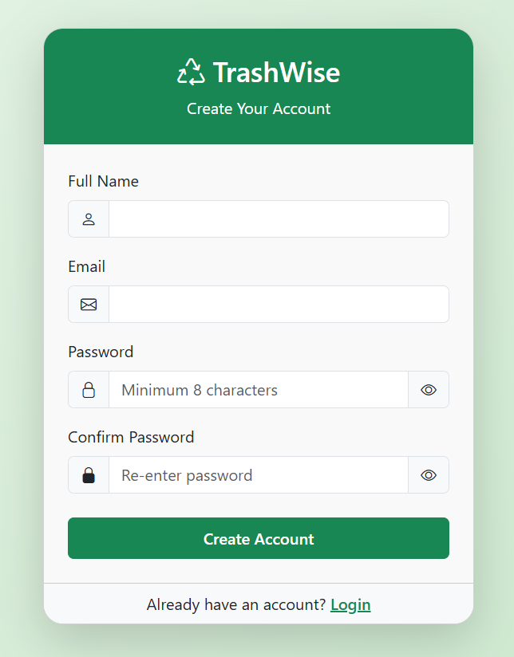  
 

<b>Login</b>

This is the login page. After logging in, the user can access the website.

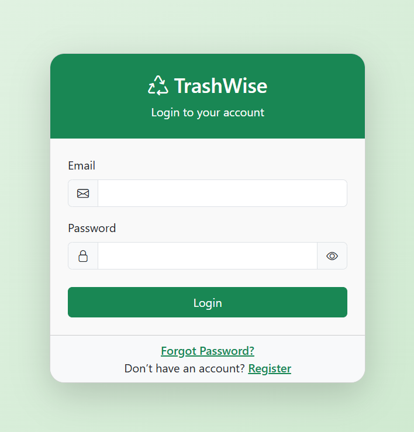  

<b>Dashboard</b>

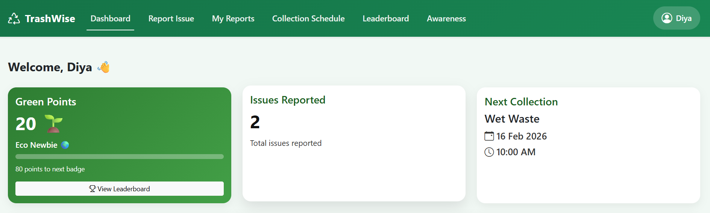 
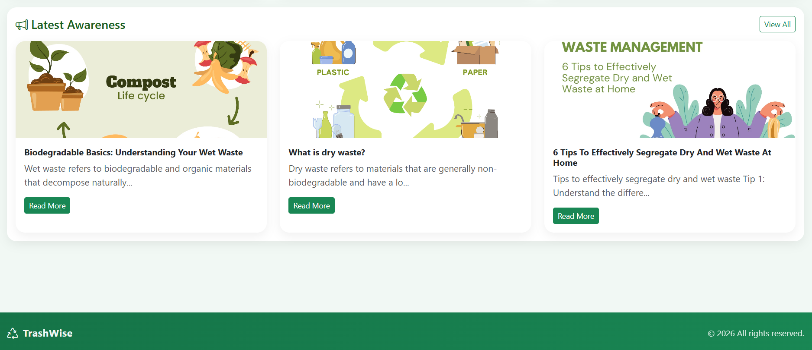  

<b>Report Issue</b>

This section allows users to report issues.

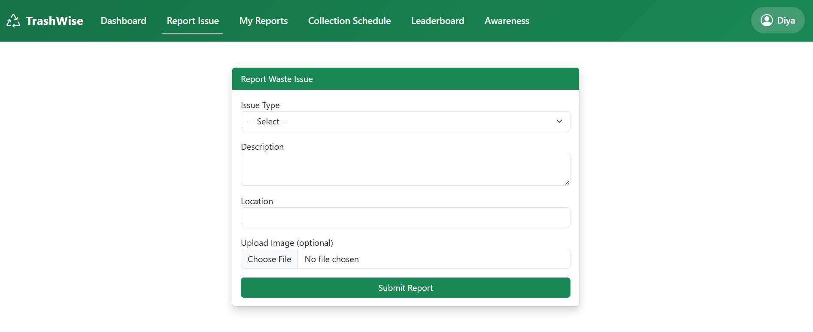  

<b>My Reports</b>

This section allows users to view their reports.

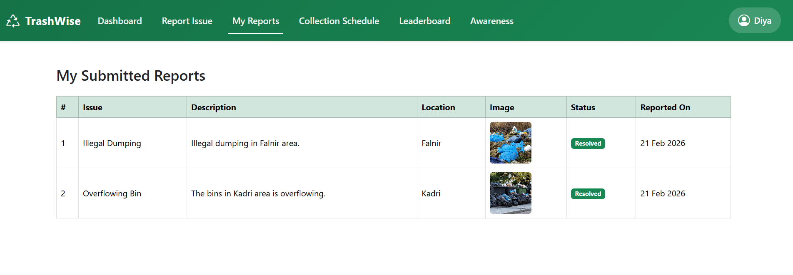  

<b>Leaderboard</b>

This section allows users to view leaderboard. Top 10 ranks will be displayed. If the user doesnt come under top 10 ranks, then their rank will be displayed separately

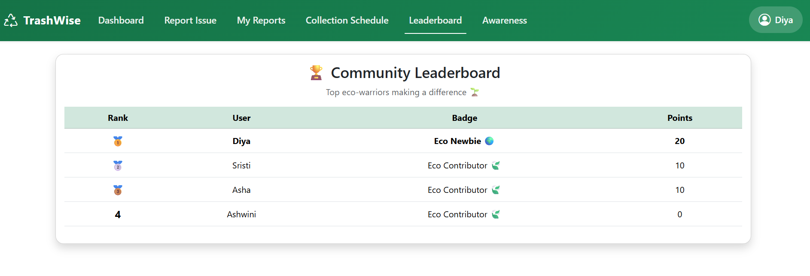  

<b>Awareness</b>

This section allows users to view their reports.

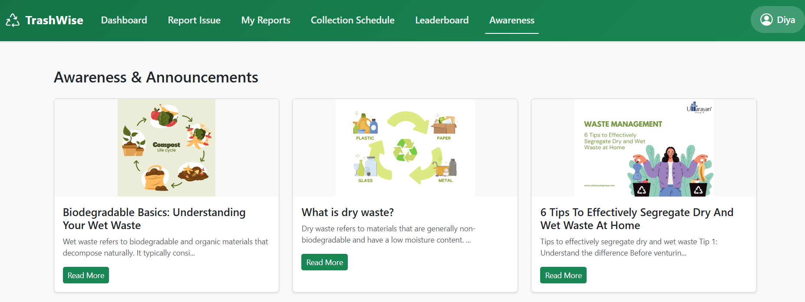  

<b>Profile</b>

Here, the users can change their name, update area, log out, or delete their account.

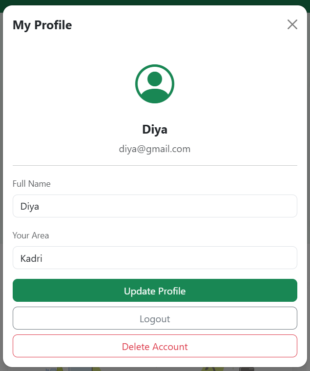  

 
<strong>Admin Side</strong>

<b>Admin Login</b>

After logging in, the admin can manage users, reports, update collection schedules, and upload awareness posts.

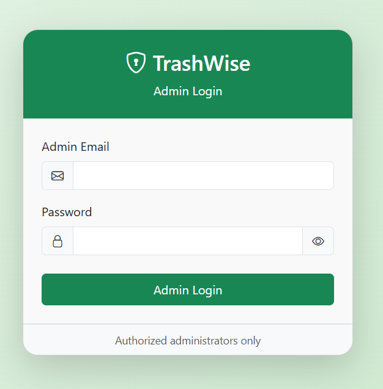  
 

<b>Dashboard</b>

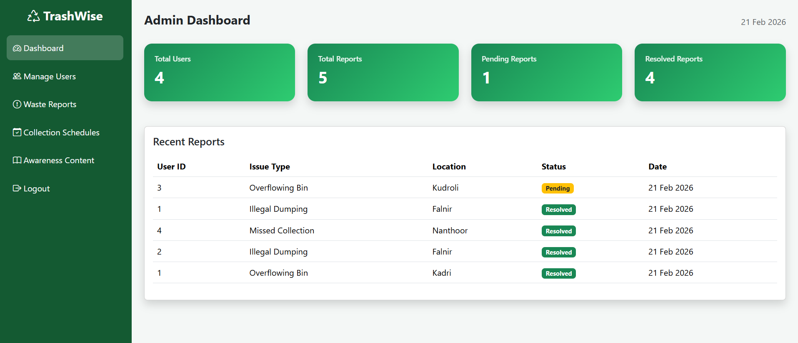  

<b>Manage Users</b>

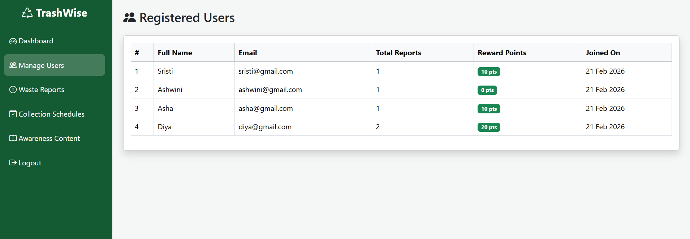  

<b>Waste Reports</b>
 
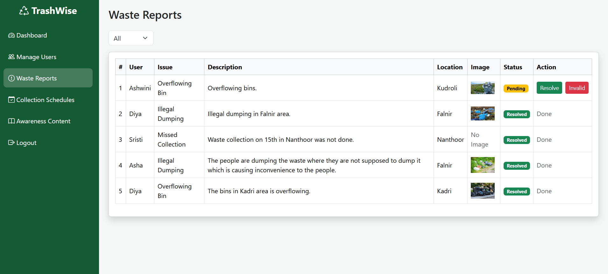  

<b>Collection Schedules</b>

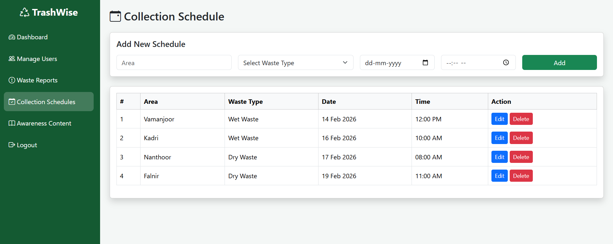  

<b>Awareness Content</b>

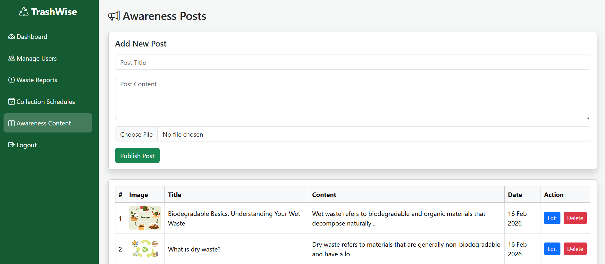

